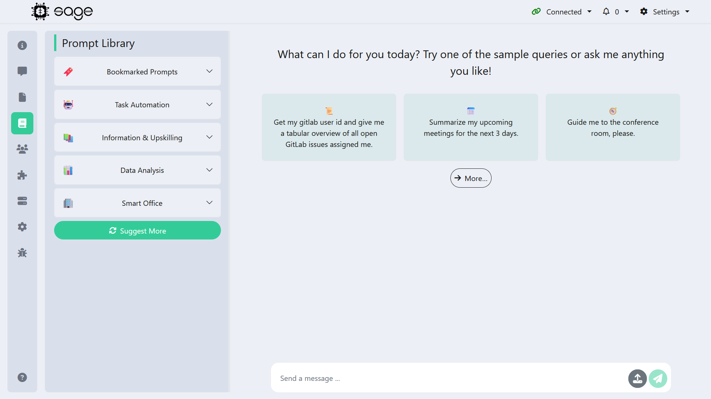

# 

A modular LLM chatbot UI for OPACA platforms with multi-agent orchestration and tool calling.

## ❓ What is SAGE?

SAGE, also referred to as the 'OPACA LLM UI', is a powerful chatbot that can fulfill user requests by calling actions from a connected [OPACA platform](https://github.com/gt-arc/opaca-core). It can be easily extended with additional agents, developed in any programming language. Multiple reference implementations can be found in the [opaca-example-containers](https://github.com/gt-arc/opaca-example-containers) repository. Further, the repository for our python package [opaca](https://github.com/gt-arc/opaca-python-sdk) includes a detailed step-by-step guide on how to develop and deploy new agents very easily using Python.



## 🚀 Quickstart

### Docker (recommended)

##### 1. Create a new .env file by copying the example

```bash
cp .env.example .env
```

##### 2. Configure (`~/.env`)

```bash
URL="http://<YOUR_IP>"                     # For example "http://192.168.1.100"
PUBLIC_URL="${URL}:8000"
VITE_PLATFORM_BASE_URL="${PUBLIC_URL}"
VITE_BACKEND_BASE_URL="${URL}:3001"
CORS_WHITELIST="${URL}:5173"
```

##### 3. Start SAGE using Docker

```bash
docker compose --profile platform up --build
```

### Native

```bash
# Change into the backend directory
cd Backend

# Install dependencies
pip install -r requirements.txt

# Start the server
python -m src.server

# Change into the frontend directory
cd ../Frontend

# Install dependencies
npm install

# Start the frontend
npm run dev
```

## 📚 Documentation

[View full documentation](docs) - Browse all available documentation pages.

### Core Components

* [User-Interface](docs/ui.md) - The main user interface of the OPACA LLM UI.
* [Methods](docs/methods_overview.md) - A brief overview of all integrated methods for task-solving.
* [Session-Handling](docs/session_handling.md) - How sessions are handled and how messages are stored.
* [Backend-API](docs/api.md) - The RESTful API of the backend.

### Task-Solving Methods

* [Simple](docs/methods/simple.md) - A simple approach using a single agent.
* [Tool-LLM](docs/methods/tool_llm.md) - A more complex approach using 3 distinct agents.
* [Orchestration](docs/methods/orchestration.md) - An orchestration approach dynamically generating multiple AI agents.

### Agent Development

* [Python Development Guide](https://github.com/gt-arc/opaca-python-sdk) - Our Python SDK provides a simple way to develop new agent containers.
* [Example Agent Containers](https://github.com/gt-arc/opaca-example-containers) - A selection of example agent containers for different use cases.

### Deployment & Testing

* [How to deploy containers](docs/container_deployment.md) - Deploy agent containers to your OPACA platform.
* [Configuration](docs/configuration.md) - Overview of SAGE configuration options.
* [Benchmarks](docs/benchmarks.md) - Performance benchmarks of SAGE.

### Help

* [FAQ](docs/faq.md) - Frequently asked questions.

## ✨ Features

### Internal Tools

Alongside the OPACA agent actions, SAGE defines a few internal tools that can be used to perform core tasks. These include:

* `ScheduleIntervalTask`: Schedules a task to be executed with a given delay and a specified amount of repititions.
* `ScheduleDailyTask`: Schedules a daily task to be executed at a given time.
* `GetScheduledTasks`: Returns a list of all scheduled tasks, yet to be executed.
* `CancelScheduledTask`: Cancels a scheduled task.
* `GatherUserInfo`: Compiles a short summary of the user (session) based on all existing conversations.
* `SearchChats`: Searches all conversations for a given query.

### Method Configuration

Each [method](docs/methods_overview.md) can be configured using the UI. Especially, each LLM component can be configured to a different model, even a locally running model. This allows for a more flexible and customizable approach to task-solving.

### Container Login

Some agent containers provide function which can only be called when authenticated, for example the Exchange Agent or Gitlab Agent available in the [opaca-example-containers](https://github.com/gt-arc/opaca-example-containers) repository. When called, these functions will prompt another login window to enter credentials for the specific service. Credentials are then sent via the platform to the agent container, which will use them to authenticate the request user. Please note that entered credentials are **never** stored in SAGE or the OPACA platform, and that after the first successful login, tokens are generated to authenticate the user instead and sent in the header for each subsequent request to that container. However, please note that the credentials will also be sent to the agent container for authentication, so only add trusted containers to your platform environment.

Also be aware that tokens are bound to an **OPACA user**, not to a session. This means that if you are running your OPACA platform with authentication disabled, ALL sessions will share their container login tokens. To enable platform authentication, see the [Authentication](#-authentication) section below.

### Speech I/O

The chatbot-UI supports speech-to-text (STT) and text-to-speech (TTS) using either the builtin functions of the Google Chrome browser, or the Whisper model. A server with accordant API routes is included in this project under tts-server, and can be included in the setup, or started elsewhere. The STT server is optional; if it is not running (or the URL is not provided), the Whisper STT and TTS features will not be available. As a fallback, the builtin functions of Google Chrome can be used, but those will only work in that browser (also not in e.g. other Chromium based browsers). Also, in any case TTS and STT will only work if the frontend is using HTTPS or running on the same host (i.e. localhost).

### Sample Prompts

When you start SAGE, you will notice a set of sample prompts that give an overview of the capabilities of SAGE. These prompts may only work if specific agents are available in the connected OPACA platform. Users are free to modify them to their liking and admins can change the default prompts.

### File Handling

Currently, SAGE can support the following file types as input:

* PDFs: `.pdf`
* Images: `.jpg, .jpeg, .png, .gif, .webp`,

Files are uploaded to the selected models in the [Method Configuration](docs/methods_overview.md) and can be accessed by the LLM afterwards. Including files cross conversations can be toggled in the File-Sidebar. Please note that not all models support file uploads.

## 🔒 Authentication

The OPACA platform that SAGE is connected to can be protected using authentication. To enable authentication on the OPACA platform, set the following environment variables in your `.env` file or directly in the [docker-compose.yml](docker-compose.yml) file under the `opaca-platform` service:

```bash
REQUIRE_AUTHENTICATION=true
SECRET=<YOUR_SECRET_KEY>
PLATFORM_ADMIN_USER=<YOUR_ADMIN_USER>
PLATFORM_ADMIN_PWD=<YOUR_ADMIN_PASSWORD>
```

Then start SAGE using the `platform` profile:

```bash
docker compose --profile platform up --build
```

When you then try to connect to the platform with SAGE, you will be prompted to enter your credentials.

An admin can further create additional users for SAGE by using the OPACA platform's Swagger-UI, usually available under http://localhost:8000/swagger-ui/index.html.

## 📄 Publication

* arXiv Pre-Print: [SAGE: Tool-Augmented LLM Task Solving Strategies in Scalable Multi-Agent Environments](https://arxiv.org/abs/2601.09750)

## Contributors

<!-- ALL-CONTRIBUTORS-LIST:START - Do not remove or modify this section -->
<!-- prettier-ignore-start -->
<!-- markdownlint-disable -->

<!-- markdownlint-restore -->
<!-- prettier-ignore-end -->

<!-- ALL-CONTRIBUTORS-LIST:END -->

<a href="https://github.com/GT-ARC/opaca-llm-ui/graphs/contributors">
  
</a>

## Acknowledgements

Copyright 2024 - 2026, GT-ARC & DAI-Labor, TU Berlin

* Main Contributors: Robert Strehlow, Tobias Küster, Oskar Kupke, Daniel Wetzel
* Further contributions by: Cedric Braun, Brandon Llanque Kurps, Chenluanxing Liu, Abdullah Kiwan, Benjamin Acar

This repository includes software developed in the course of the project "Offenes Innovationslabor KI zur Förderung gemeinwohlorientierter KI-Anwendungen" (aka Go-KI, https://go-ki.org/) funded by the German Federal Ministry of Labour and Social Affairs (BMAS) under the funding reference number DKI.00.00032.21.
