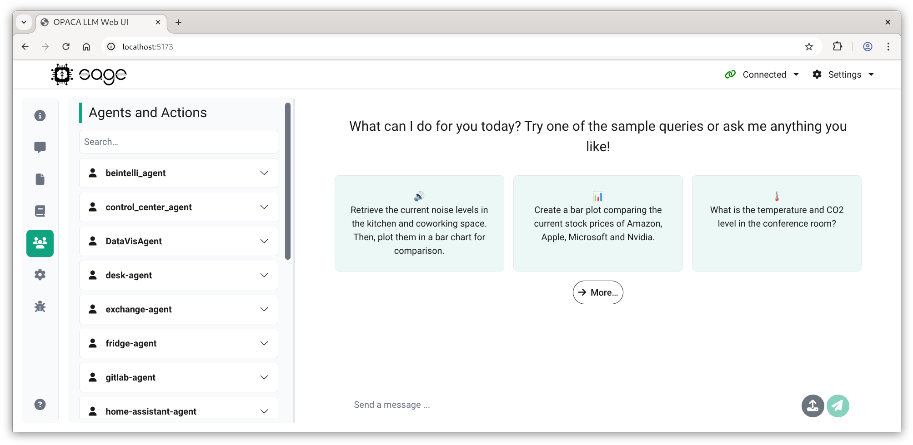

# OPACA LLM UI

Copyright 2024 - 2025, GT-ARC & DAI-Labor, TU Berlin

* Main Contributors: Robert Strehlow, Tobias Küster, Oskar Kupke, Daniel Wetzel
* Further contributions by: Cedric Braun, Brandon Llanque Kurps, Abdullah Kiwan, Benjamin Acar

This (https://github.com/gt-arc/opaca-llm-ui/) is the public repository of the OPACA LLM UI project. Feel free to create issues if you have any suggestions, or improve things yourself with a fork and pull request. The main development work still happens in the internal/private repository at https://gitlab.dai-labor.de, including most (internal) tickets, development branches, merge requests, build pipelines, etc.

This repository includes software developed in the course of the project "Offenes Innovationslabor KI zur Förderung gemeinwohlorientierter KI-Anwendungen" (aka Go-KI, https://go-ki.org/) funded by the German Federal Ministry of Labour and Social Affairs (BMAS) under the funding reference number DKI.00.00032.21.

## About

The OPACA LLM UI is a powerful chatbot that can fulfill user requests by calling actions from a connected OPACA platform. It consists of two parts: The actual UI / frontend, implemented in Javascript and Vue, and multiple "backends" connecting to an LLM API. The OPACA LLM UI does not include any specific actions but takes all its functionality from the connected OPACA platform.

### Frontend

The web UI is implemented in Javascript using Node and Vue. It consists of several components:

* A main chat window, showing the messages in the current interaction and an input field for submitting messages. The LLM's output is interpreted and formatted as Markdown, allowing for text formatting, code snippets, and embedded images (the LLM itself an not generate images, but it can display images if e.g. the URL to an image was returned from an action). The UI also allows for speech input and output (if the last message was spoken, the response will automatically be read out aloud). Each response by the LLM includes additional "debug" output that can be expanded.

* A collapsible sidebar providing different sections for configuring the OPACA Runtime Platform to connect to, browsing the list of available agents and actions, configuring details of the used LLM Backend, and showing additional debug output.

* A Navigation/Header bar, allowing to switch the UI language and the used LLM Backend.

Several aspects of the UI, such as the available and default backends, the selection of sample prompts, or the language can be configured in `config.js`.

The Web-UI in this project was originally based on the LLM-Chat feature of the [ZEKI Wayfinding](https://gitlab.dai-labor.de/smart-space/wayfindingzeki) by Tobias Schulz, but has since been significantly extended and refactored.

[read more...](docs/ui.md)

### Backend

The backend consists of a general part, providing a simple HTTP API to be used by the frontend for calling the LLM functions (also providing a simple FastAPI UI, useful for testing), and a client for connecting to a specific OPACA runtime platform for retrieving and calling the available agent actions, and several alternative approaches to actually querying the LLM and extracting the agent actions to be executed: 

* Simple: Using a simple prompt including the different available actions and querying the LLM in a loop, extracting the actions to call from the LLM's output.

* ToolLLM: Two agents using the built-in 'tools' parameter of newer models.

* Orchestration: A two-staged approach, where an orchestrator delegates to several groups of worker agents, each responsible for different OPACA agents.

* Simple Tool: A single agent, as in 'Simple', but using the 'tools' parameter.

The different approaches provide additional configuration parameters, e.g. for the model version to use, and most support both **GPT** (gpt-4o & gpt-4o-mini) by OpenAI and **vLLM** to use locally deployed models (e.g. Mistral, Llama, ...)

[read more...](docs/methods_overview.md)

### Sessions, Message History and Configuration

The message history and configuration (model version, temperature, etc.) is stored in the backend, along with a session ID, associating it with a specific browser/user. The history is shared between different LLM backends, i.e. if the performance of once backend is not satisfactory, one can switch to another one and continue the same conversation. Also, the LLM will "remember" the past messages when revisiting the site later, or opening a second tab in the same browser, even though the chat window appears empty. Clicking on the "Reset" button (lower right, red) will reset the message history, but not the configuration. To reset the configuration, a user can click the "Reset to Default" button in the configuration view, which resets the configuration for the currently selected backend to its default values.

The Session ID is stored as a Cookie in the frontend and sent to the backend. On the first request, when no Cookie is set, the backend will create a new random Session ID and associated session data and set the Session ID as a Cookie in the response. It will then automatically be used by the frontend in all subsequent requests until the session is terminated. A session ends when the browser window is closed.

The message handling of the OPACA LLM is illustrated in the image above. During a request, only the initial message query which was entered by the user in the UI is sent to the backend. Upon retrieval, the session ID associated with that user is used to fetch the individual message history. It consists of message pairs, linking a user query to the final output of the OPACA LLM. These message pairs are the exact messages displayed in the UI (excluding the "welcome" message). Combined with the current user query, all messages are sent to the OPACA LLM to generate an answer. In the case of the Tool LLM method, only the Tool Generator agent needs the complete message history. The Tool Evaluator agent only requires the current query and the internal message history. The internal messages are the generated outputs of both agents, used as inputs for the next agent. The final answer generated by the OPACA LLM is then added with the current query as a message pair to the message history in the backend, associated with the session ID.

[read more...](docs/session_handling.md)

### Speech Input and Output

The chatbot-UI supports speech-to-text (STT) and text-to-speech (TTS) using either the builtin functions of the Google Chrome browser, or the Whisper model. A server with accordant API routes is included in this project under `tts-server`, and can be included in the setup, or started elsewhere. The STT server is optional; if it is not running (or the URL is not provided), the Whisper STT and TTS features will not be available. As a fallback, the builtin functions of Google Chrome can be used, but those will only work in that browser (also not in e.g. other Chromium based browsers). Also, in any case TTS and STT will only work if the frontend is using HTTPS or running on the same host (i.e. localhost).

## Configuration and Parameters

The OPACA LLM can be configured in various ways using the `config.js` file in the Frontend directory. Here, you can configure, among others, the default OPACA Platform to connect to, which sample questions to show, which backend options to show, as well as some UI settings. Some of those settings can also be configured using Environment Variables (see next section), while others can be overwritten using Query parameters (i.e. appending `?abc=foo&xyz=bar` to the request URL):

* `autoconnect`: If true, attempt to automatically connect to the default OPACA Platform (without authentication)
* `sidebar`: Which tab of the sidebar to show after connecting; possible options: `none` (hide), `connect` (stay on connect page), `questions` (sample questions), `agents` (agents and actions), `config` and `debug`.
* `samples`: Which category of sample questions to show; possible options see "headers" in the `sidebarQuestions` section in the config (special characters might have to be URL-encoded), plus `random` for a random selection.
* `lang`: Which language to use by default; possible options: "GB" (english) and "DE" (german).
* `colorscheme`: The starting color scheme, can be "light", "dark", or "system".

## Environment Variables

### Frontend

Frontend env-vars correspond to settings in `config.js`; check there for context and default values. Env vars have to start with `VITE_` so they are evaluated when the app is started (i.e. taking values defined on the host system).

* `VITE_PLATFORM_BASE_URL`: The default URL where to find the OPACA platform
* `VITE_BACKEND_BASE_URL`: The URL where to find the backend
* `VITE_DEFAULT_BACKEND`: The default backend to use, see options in `config.js`
* `VITE_BACKLINK`: Optional 'back' link to be shown in the top-left corner.
* `VITE_VOICE_SERVER_URL`: Where to find the TTS-server; this is optional, but if missing, speech-input is not available.
* `VITE_AUTOCONNECT`: Whether to automatically connect to the given OPACA URL on load; only if no auth is required, and can be overwritten with `autoconnect` query parameter.
* `VITE_COLOR_SCHEME`: The starting color scheme, can be "light", "dark", or "system"; can be overwritten by `colorscheme` query param.
* `VITE_DEFAULT_LANGUAGE`: The language to use by default in the UI. Possible options: "GB" (english), "DE" (german).

### Backend

* `OPENAI_API_KEY`: OpenAI API key needed to use GPT models; go to [their website](https://platform.openai.com) to get one.
* `VLLM_BASE_URL`: Alternatively to using OpenAI, location of vLLM API to use (e.g. for LLAMA and other models).
* `VLLM_API_KEY`: API key for the vLLM API, if any.
* `FRONTEND_BASE_URL`: The URL of the frontend, analogous to `VITE_BACKEND_BASE_URL` (may be needed for CORS; defaults to localhost)
* `SMARTSPACE_BASE_URL`: The URL of the Smartspace UI (may be needed for CORS; defaults to localhost)

## Getting Started

### Using Docker Compose

To build and start the OPACA LLM UI, simply run the Docker Compose: `docker compose up --build`. You can then find the Frontend at `http://localhost:5173` and the backend (FastAPI) at `http://localhost:3001/docs`. Specify the OPACA Platform to connect to (including login credentials, if authentication is enabled) and hit the "Connect" button. The UI should automatically switch to the view showing the available actions, and you can start interacting with the LLM via the chat window.

### Development and testing

For testing and development, you might want to run your own OPACA Platform and example containers.

1. Start the OPACA Platform

   * Clone the [OPACA-Core Repository](https://github.com/GT-ARC/opaca-core) and follow the **Getting Started** guide to build and launch an OPACA runtime platform.

2. Deploy a container for testing
   * Create and build a sample OPACA Agent Container following the same guide. You can use the `sample-container`, but it's actions are mostly meant for unit-testing and don't do anything really useful.
    * Alternatively, a Smart-Office themed example container is available from Docker Hub as `rkader2811/smart-office`
    * Use the OPACA Platform's `POST /containers` route to deploy the container

3. Start the Opaca-LLM

   * In the Backend directory, run `pip3 install -r requirements.txt` and then `python3 -m src.server` to start the backend server.
   * In the Frontend directory, run `npm install` followed by `npm run dev` to run the frontend / web-UI; other than using Docker Compose, this allows for hot code replace while the application is running.
   * Alternatively, run `npm run dev_all` to start both, the backend and the frontend in parallel.

Then, as above, go to `http://localhost:5173`, connect to the OPACA platform and start interacting with the LLM.

## Read More...

* [User Interface](docs/ui.md)
* [Backend API](docs/api.md)
* [Models](docs/models.md)
* [Communication](docs/communication.md)
* [Session Handling](docs/session_handling.md)
* [LLM Communication Methods](docs/methods_overview.md)
  * [Simple](docs/methods/simple.md)
  * [Tool-LLM](docs/methods/tool_llm.md)
  * [Orchestration](docs/methods/orchestration.md)
* [Frequently Asked Questions](docs/faq.md)
