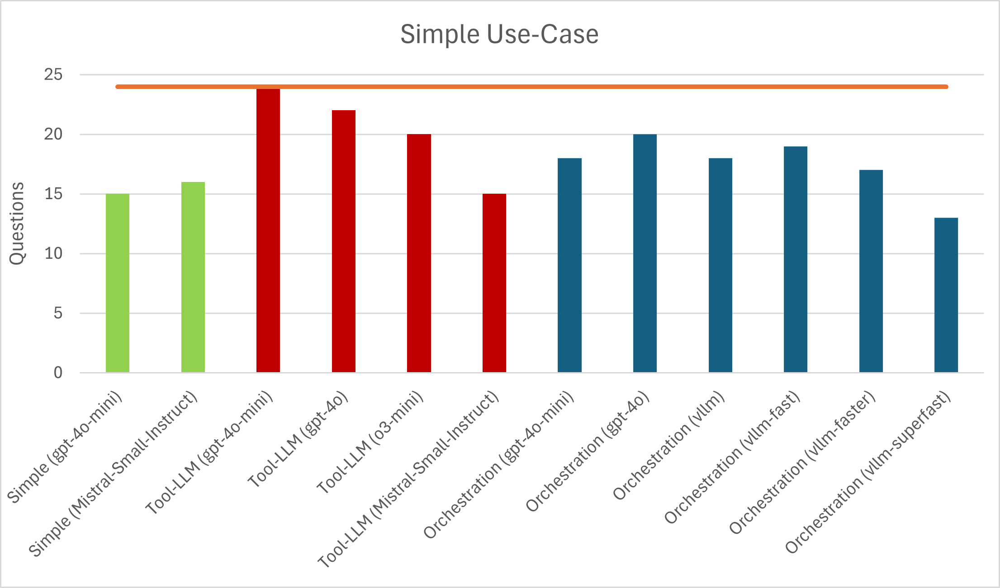
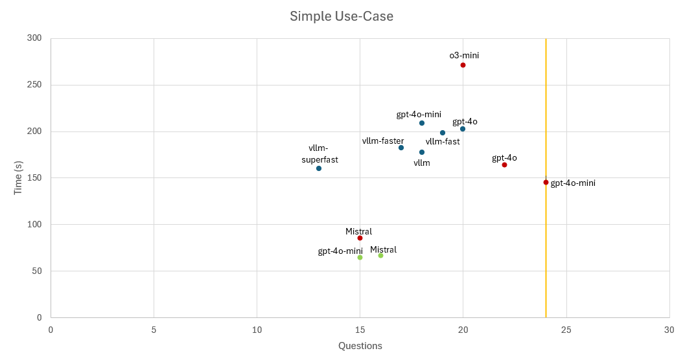
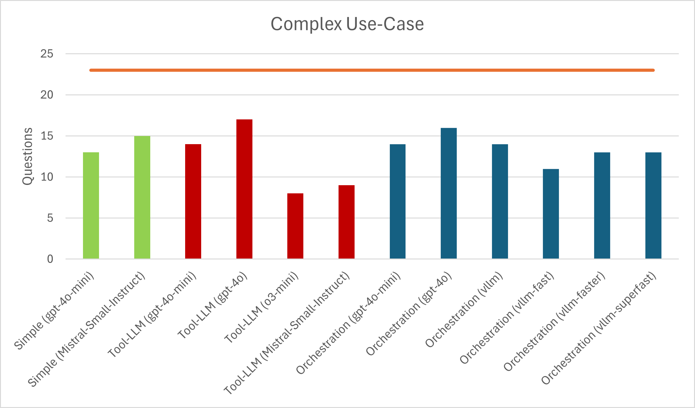
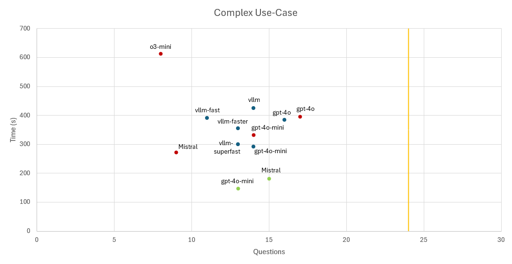

# Performance Testing

The different backend methods of the OPACA-LLM can be tested within a designated testing environment. Two different questions sets have been created, to test the answer quality of our implemented methods. The first question set, labeled _simple_, contains questions that would only lead to the invocation of exactly one OPACA action. The question set labeled _complex_ contains questions which would result in numerous OPACA action invocations in one or more internal iterations. To evaluate the answer generated by the OPACA-LLM, each question in both question sets includes an expected answer and a list of expected tool calls. The actual response by the OPACA-LLM and the expected answer are compared by a Judge-LLM using _gpt-4o_. The tool calls are evaluated manually by sophisticated evaluation functions. The simple and complex question sets have a size of 180 and 41 respectively.

## Quickstart

To run the benchmark tests, execute the following command

`python3 .\benchmark\run.py -s simple -b tool-llm -m gpt-4o-mini -o http://{YOUR_LOCAL_IP}:8000 -p 20`

This will start a benchmark run for the `simple` question set scenario and use the `tool-llm` method with the `gpt-4o-mini` model. It will use 20% of the simple question data set randomly selected. You can find out your local IP by running `ipconfig` in any console. After a complete benchmark run, the results will be written into a JSON file located in `\benchmark\test_runs`

## Test settings

The test script includes a variety of different flags that can be used:

- `-s, --scenario`: The scenario that should be tested. Valid scenarios are `simple`, `complex`, `all`.
- `-b, --backend`: The backend that will be used. (default: `tool-llm`)
- `-m, --model`: The LLM that will be used. Note that for the `self-orchestrated` backend, the model configuration key (located in the [model_config.yaml](https://gitlab.dai-labor.de/jiacpp/tools/opaca-llm-ui/-/blob/master/Backend/src/orchestrated/model_config.yaml)) has to be used instead. (default: `gpt-4o-mini`)
- `-o, --opaca-url`: The URL where the OPACA platform is running. If no URL is given, the script will try to determine your local IP address itself, although this is not always working properly. (default: `None`)
- `-l, --llm-url`: The URL where the OPACA-LLM is running. (default: `http://localhost:3001`)
- `-i, --iterations`: The number of iterations that will be executed. A single iteration will test all requests defined in the question set scenario. (default: `1`)
- `-c, --chunks`: The number of chunks the question set will be broken into and tested in parallel. More chunks speed up the benchmarking process but could also negatively impact the time performance value of the test. (default: `5`)
- `-j, --judge`: If this flag is provided, the judge-llm will be used. (WARNING: Using the judge-llm with large question sets will become expensive)
- `-p, --portion`: Defines the portion size of the selected question set. The portions will be randomly sampled. The portion size is given in percentages. (default: `100`)
- `--log-level`: The log-level of the benchmark test. (default: INFO)

The result file will have the following naming format: `{backend}-{model}-{date}.json`. The result JSON file is structured as follows:

```
{
  "iteration_{n}": {
    "question": [
      # List of detailed information about each question and their results
    ]
    "summary": {
      # Summarized information about this iteration run
    }
  }
  ...
  "total_summary": {
    # Summarized information about all iterations
  }
}
```

## Benchmark Information

### Individual Requests

In the final JSON file, each request given to the OPACA-LLM will have individual information associated with it. This information includes:

- `question`: The original request that was given to the OPACA-LLM.
- `expected_answer`: The expected answer and information that should be present in the response.
- `response`: The final response that was provided by the OPACA-LLM.
- `iterations`: The number of internal iterations it took for the method to formulate the final answer.
- `time`: The time it took for the answer to be generated. This value is measured by the method itself.
- `server_time`: The time it took for the answer to be generated. This value is measured by the test script.
- `agent_time`: A breakdown of the individual llm components and their respective time used in the selected method.
- `response_metadata`: Includes information about token usage for this request. Only differentiates between prompt tokens and completion tokens.
- `called_tools`: The number of total tools that were called for this request.
- `tools`: A detailed list of the tools that were called. The tools are ordered by iterations. Example: `[[{Tool1}, {Tool2}], [{Tool3]]`: `Tool1` and `Tool2` were both called in the first iteration, `Tool3` in the second iteration.
- `score`: The score received by the Judge-LLM. Scores range from 1 to 5.
- `reason`: The reason the Judge-LLM has provided for the given score.
- `tool_matches`: Includes information about the correctness of generated tools. Each expected and actual tool call is listed in one of the three categories:
  - `match`: Includes all actual tool calls that were also expected and correctly formulated.
  - `missed`: Includes all expected tool calls not found in the actual tool calls.
  - `extra`: Includes all actual tool calls not found in the expected tool calls.

### Summary Information

Each complete iteration and benchmark run also captures summary information for a better overview of the achieved results:

- `backend`: The used backend for this benchmark run.
- `model`: The used LLM for this benchmark run. Note that for the `self-orchestrated` backend this value will contain the model-configuration key defined in [model_config.yaml](https://gitlab.dai-labor.de/jiacpp/tools/opaca-llm-ui/-/blob/master/Backend/src/orchestrated/model_config.yaml).
- `question`: The total number of requests/questions that were given to the OPACA-LLM.
- `correct_tool_usage`: The total number of requests in which there are no _missed_ tool calls.
- `perfect_tool_usage`: The total number of requests in which there are no _missed_ **and** _extra_ tool calls.
- `average_score`: The average score of all requests.
- `total_time`: The total amount of time all requests required. This value is measured by the method itself.
- `total_server_time`: The total amount of time all requests required. This value is measured by the test script.
- `agent_time`: Accumulated time each llm component of the selected method was active.
- `total_token_usage`: The total number of tokens that were used for all requests.

### Scoring system

The `score` parameter is a value between 1 and 5. The Judge-LLM has been given the following definitions to determine the response quality:

- 1 – Completely Irrelevant: The response does not include any of the expected information and does not address the initial request in a meaningful way. It may be entirely off-topic, misleading, or nonsensical.
- 2 – Attempted but Unsuccessful: The response attempts to address the request but fails to include any correct or expected information. It may contain generic or off-base content with no real value in context.
- 3 – Partially Correct: The response includes some of the expected information, but omits key details or contains significant inaccuracies. The answer is incomplete or only partially useful.
- 4 – Mostly Correct: The response includes all key expected information, but lacks precision, clarity, or depth. It may contain minor inaccuracies, vague phrasing, or insufficient justification.
- 5 – Fully Correct and Precise: The response includes all expected information and is clear, precise, well-structured, and meets the requirements of the request completely. It may also demonstrate nuance or thorough understanding.

## Tool Evaluation

The test script manually evaluates tool usage. To realize this, the following 3 classes have been implemented:

### Tool Evaluating Models

```
class EvalMatch(Enum):
    EXACT = "exact"                    # The parameter value has to match exactly the expected value
    PARTIAL = "partial"                # The parameter value should include the expected value (e.g. expected 'mouse' would be true for 'computer mouses')
    NONE = "none"                      # The value is not necessary for the comparison, only the type

class EvalToolParam(BaseModel):
    key: str                                # The key of a parameter
    value: Any                              # The value of a parameter
    match: EvalMatch = EvalMatch.EXACT      # How 'strict' the value should align with the actual value
    optional: bool = False                  # Optional means that this parameter is not required necessarily

class EvalTool(BaseModel):
    """Defines a tool evaluation class storing some additional information for consideration"""
    name: str                               # The exact name of the expected tool
    args: List[EvalToolParam] = []          # A list of the expected parameter names AND values
    optional: bool = False                  # Optional means that this tool call is not required necessarily
    id: int = -1                            # An id to identify a tool call. Used in combination with dependencies.
    depends: List[int] = []                 # A list of tool calls that should be executed before this one indicated by their id
    alternatives: List[List[int]] = []      # A list of alternative call ids, which could have been called instead. Can include one or multiple calls as alternatives
```

### Example Usage

The following is an example request which is part of the complex question set.

```
{
    "input": "Please run a full system check. Summarize the results for me and for every damaged device, I want you to schedule a maintenance date on the 1st of February 2025",
    "output": "The answer should give an overview of the current status of each device in the system. There are in total 5 devices in the system. The devices 'Thermostat' and 'Security Camera' should have been found as damaged. Further, it should give a confirmation about the scheduling of maintenance dates on the 1st of February 2025 for the 'Thermostat' and 'Security Camera'.",
    "tools": [
        EvalTool(name="RunFullSystemCheck", id=0),
        EvalTool(name="GetDeviceId", id=1, depends=[0], args=[EvalToolParam(key="device_name", value="thermostat", match=EvalMatch.PARTIAL)]),
        EvalTool(name="GetDeviceId", id=2, depends=[0], args=[EvalToolParam(key="device_name", value="camera", match=EvalMatch.PARTIAL)]),
        EvalTool(name="ScheduleMaintenance", id=3, depends=[1], args=[EvalToolParam(key="device_id", value=0), EvalToolParam(key="date", value="2025-02-01")]),
        EvalTool(name="ScheduleMaintenance", id=4, depends=[2], args=[EvalToolParam(key="device_id", value=2), EvalToolParam(key="date", value="2025-02-01")]),
    ]
}
```

The `input` will be given to the OPACA-LLM as a request during the benchmark test. The `output` includes expected information that should be present in the generated response. The `tools` is the place where the expected tools calls can be formulated.

Some guidelines for defining expected tools:

- Make sure to use the _exact_ tool name. The name can include the agent name, such as `RoomAgent--BookRoom` but does not have to.
- Ids are mainly used to define an execution order. Tools with lower ids will get evaluated first. This is especially important if there are dependencies. Tools on which other tools depend on **must** have a lower id. If no ids are given, each tool will be initialized with id `-1` and their evaluation order might be random.
- Tools which are marked as `optional` do not contribute to a missing or extra tool call. The same is true for optional parameters.
- Tools which are dependent on other calls will be marked as _missed_ if the dependent calls have not been called correctly, even if the current call is correct. This is to prevent "guessing" by the methods.
- Alternatives can be defined to present a different valid solution approach.
- Alternatives should be defined by each tool that has been marked as an alternative by another tool.
- If one complete tool sequence of alternatives has been found, their alternatives do not contribute to missing tools calls. However, if one tool sequence with alternatives has already been found and their alternatives have been called as well, the alternatives would be considered _extra_ tool calls.
- The `EvalMatch.PARTIAL` option is mostly meant for string types. For this case it is only checked if the expected lower-case parameter value is found to be part of the actual lower-case value.
- The `EvalMatch.NONE` option disregards the parameter value check, but it does **not** make the required presence of the parameter obsolete.

## Results

The following are results that were achieved with the given method and model combination. The date of when the results were achieved is given at the bottom.

### Simple Use-Cases

The _simple_ questions contain requests to the OPACA-LLM, which result in a single action call.

| Method (model)                                                  |  Result   |   Time    | Token Usage (total) |
|-----------------------------------------------------------------|:---------:|:---------:|:-------------------:|
| Simple (gpt-4o-mini)                                            |   15/24   | **64.6s** |       287046        |
| Simple (Mistral-Small-Instruct)                                 |   16/24   |   66.7s   |       293422        |
| Tool-LLM (gpt-4o-mini)                                          | **24/24** |  145.7s   |       308134        |
| Tool-LLM (gpt-4o)                                               |   22/24   |  163.9s   |       368223        |
| Tool-LLM (o3-mini)                                              |   20/24   |  271.3s   |       304185        |
| Tool-LLM (Mistral-Small-Instruct)                               |   15/24   |   85.5s   |       465965        |
| Orchestration (gpt-4o-mini)                                     |   18/24   |  208.8s   |       242081        |
| Orchestration (gpt-4o)                                          |   20/24   |  202.3s   |       210487        |
| Orchestration (vllm)                                            |   18/24   |  177.1s   |       274727        |
| Orchestration (vllm-fast)                                       |   19/24   |  198.1s   |       239636        |
| Orchestration (vllm-faster)                                     |   17/24   |  182.1s   |       223442        |
| Orchestration (vllm-superfast)                                  |   13/24   |  159.9s   |       200792        |




### Complex Use-Cases

The _complex_ questions contain requests to the OPACA-LLM, which will always require multiple action calls. The requests either result in multiple action calls which can be executed in parallel, or which are dependent on each other.

| Method (model)                                                  |  Result   |    Time    | Token Usage (total) |
|-----------------------------------------------------------------|:---------:|:----------:|:-------------------:|
| Simple (gpt-4o-mini)                                            |   13/23   | **146.5s** |       576450        |
| Simple (Mistral-Small-Instruct)                                 |   15/23   |   180.4s   |       554301        |
| Tool-LLM (gpt-4o-mini)                                          |   14/23   |   332.8s   |       504813        |
| Tool-LLM (gpt-4o)                                               | **17/23** |   395.4s   |       725644        |
| Tool-LLM (o3-mini)                                              |   8/23    |   613.5s   |       476272        |
| Tool-LLM (Mistral-Small-Instruct)                               |   9/23    |   271.8s   |       830405        |
| Orchestration (gpt-4o-mini)                                     |   14/23   |   291.0s   |       300090        |
| Orchestration (gpt-4o)                                          |   16/23   |   383.6s   |       316553        |
| Orchestration (vllm)                                            |   14/23   |   423.8s   |       426375        |
| Orchestration (vllm-fast)                                       |   11/23   |   389.7s   |       382549        |
| Orchestration (vllm-faster)                                     |   13/23   |   355.3s   |       348786        |
| Orchestration (vllm-superfast)                                  |   13/23   |   300.0s   |       317818        |




Please keep in mind, these results are only preliminary and the quality of each question has been measured by another LLM (gpt-4o). Therefore, the performance overview only provides a rough estimate of the actual performance of each method.
 
Last update: 17.03.2025
