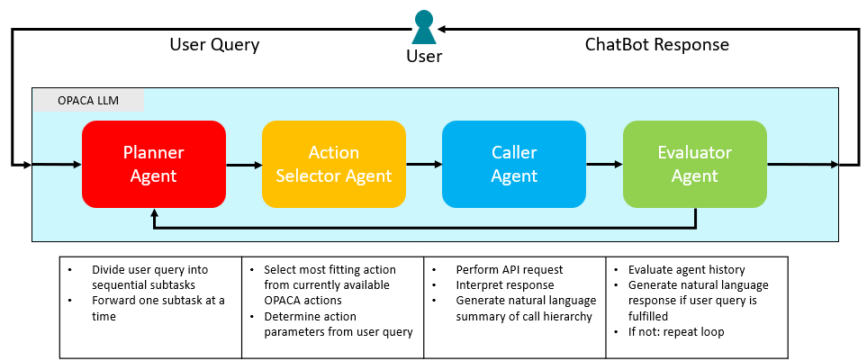

# Rest-GPT

The Rest-GPT approach was developed based on the paper [RestGPT](https://github.com/Yifan-Song793/RestGPT). The main idea is, to split the workload required to fulfill a user query. These tasks include the plan generation, in which concrete steps are generated and should be executed as the next course of action. Next would be the concrete action call formulation, in which the name of the most fitting action is selected and the right parameters are set, based on the user's input. After formulating an action call, the returned result needs to be analyzed against the given action definition. Finally, it has to be decided whether the user query has been fulfilled, or if another iteration within the architecture is necessary. If not, the response shown to the user needs to be generated as well.

## Agents

Each agent is of type `LLMAgent`. Each agent has its unique system prompt while also providing additional "slim" prompts, which are more condensed version of the normal prompts, to reduce the input for each model. Slim prompts are available for the Planner, Action Selector, and Evaluator agents.

### Planner

The Planner receives each available action from the OPACA platform in a custom format within its system prompt. The action format includes the action's name, definition, and parameters. The main goal of the Planner is to output the next concrete step to fulfill the user query, based on the provided list of actions. After one iteration, the Planner will receive results for its first step, from which it will generate the next step to fulfill. 

Additionally, the Planner has the ability to abort the chain by outputting the keyword `STOP`. In this case, the remaining generated output will be given to the user directly. This would be the case, if the user query does not require the usage of any OPACA actions, but can also occur, if the Planner has repeatedly received negative responses for its steps and believes the current query is unable to be answered. 

The Planner is also meant to abort the chain, if some required parameters for the most fitting OPACA action is not given by the user and neither available to retrieve from other OPACA actions. In this case, the Planner should also output the keyword `STOP` and ask the user to provide the missing arguments.

The output of the Planner is directly forwarding to the next agent within the chain, the Action Selector.

### Action Selector

The action selector is tasked to only output the required information to formulate an action call, containing the required action name and parameters for the received plan step, which was generated by the Planner. To be able to generate a correctly formatted action call, the Action Selector is given every available OPACA action as well, including the same information the Planner already received (action name, definition, parameters), but with the additional definition of custom parameters, if an OPACA action has defined any. The concrete format the Action Selector should abide to, is the following:

`API Call: action_name;{"parameter_name": "value"}`

The `API Call: ` prefix should be a first indicator for a correctly formatted message. Everything in the same line after this prefix is assumed to be the information regarding the action call. Any other output after this line is ignored.

Additionally, the Action Selector is equipped with a so-called _Action Validator_. This Validator is active after the first generated output by the Action Selector. In this validator, the generated action call is validated against its definition returned by the OPACA platform. The validator checks for the following criteria:

- The existence of a semicolon `;` to divide the action name from the action parameters.
- If the action includes the agent's name, the occurrence of a double dash `--` to separate the agent name from the action name
- If the parameters have been generated in a valid JSON format
- If the generated action name does exist
- If all required parameters were generated
- If no parameter name is hallucinated

If the validator has observed at least one infraction, a fitting error message is returned and given to the Action Selector, to re-generate its output given the reiterated constrains. Per invocation of the Action Selector agent, it has a maximum ability to validate its output two times. This means, during a whole iteration of Rest-GPT, the Action Selector might be called three times during a single iteration.

The extracted action call is then given to the next agent in the chain.

### Caller

Within the Caller, the received action call will be invoked on the connected OPACA platform. The Caller then receives the proposed action, its result, alongside the given action definition and generates a short summary explaining the returned value. This is done to interpret values in a more natural way for the LLM. Example: If a function is called _getTemperature_ and returns the number 34.3 without any explanation, the LLM cannot be sure of the value's unit. However, if the given action definition specifies the returned unit to be Celsius, the Caller would now correctly summarize the returned value to be of unit Celsius.

The generated summary of the caller will be used as the answer for the current iteration and used by the Planner and Action Selector as the result that was achieved in combination with their outputs.

### Evaluator

All generated outputs by each previous agent will be given to the Evaluator in addition to the original user query, to decide, whether the original request has been fulfilled or if another iteration of Rest-GPT is necessary. In its system prompt, the Evaluator will not receive any actions, since it does not require them for its functionality.

The Evaluator is tasked to always output one of two keywords: `CONTINUE` to let another iteration of the Rest-GPT chain run with the updated results, or `FINISHED`. In the latter case, the Evaluator will additionally summarize all steps and generate the final response shown to the user.

## Architecture



## Configuration

The following values are **defaults**.

```
{
    "slim_prompts": {
        "planner": True,
        "action_selector": True,
        "evaluator": False
    },
    "examples": {
        "planner": False,
        "action_selector": True,
        "caller": True,
        "evaluator": True
    },
    "use_agent_names": True,
    "temperature": 0,  # Temperature for models
    "gpt-model": "gpt-4o-mini",
    "llama-url": "http://10.0.64.101:11000",
    "llama-model": "llama3.1:70b",
}
```

- `slim_prompts`: For each supported agent, determines whether the agent should use the alternative "slim" prompt
- `examples`: For each agent, determines whether the agent should include examples (few shot prompt)
- `use_agent_names`: If enabled, the action name will consist of the original action name and the agent's name which provides the action. This is useful in environments with multiple agents of the same kind.
- `temperature`: The used temperature for the selected model (Only used for OpenAI models)
- `gpt-model`: The name of used OpenAI model.
- `llama-url`: The url where the connected llama model is running.
- `llama-model`: The name of the llama model to be used.
