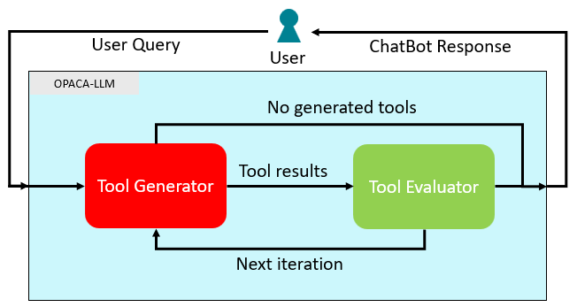

# Tool LLM

In this method, the tool section of newer models will be used to let the models directly formulate tool calls. This method is only available for newer models, which support the generation of tools.

## Agents

### Tool Generator

Once a message has been received, the Tool Generator is tasked to output the next required tool call in its tool section. Generally, if the Tool Generator has not generated any tool calls, it is assumed no tool calls were necessary and the generated content ("normal" text output of the model) will be returned directly to the user.

The Tool Generator receives a formatted list of all available OPACA action, transformed into the function definition, [defined by OpenAI](https://platform.openai.com/docs/guides/function-calling). Due to limitations, it is only possible to provide up to 128 tools per call. If an OPACA environment with more than 128 actions is used in combination with the OPACA LLM, a warning is printed in the backend and the excessive tools will simply be removed from list of tools given to the Tool Generator.

Models outputting tools are also able to formulate multiple tool calls at the same time, if those calls can be safely executed in parallel.

After the initial tool generation, a simple type fix is used to cast parameter values in their correct type. This is only available for the types _string_, _number_, _integer_, and _boolean_. This procedure will not throw any errors if a type cast was unsuccessful.

Once the Tool Generator has formulated a tool call and the types were checked and potentially fixed, the action information is extracted and used to invoke the OPACA action on the connected platform. The action names, parameters and responses are each stored in an internal message history.

### Tool Evaluator

After the invocation of the generated OPACA action calls, the Tool Evaluator will receive the original user query, a list of invoked actions, a list of used parameters, and a list of received responses for each of the generated actions during the current user request.

Similar to the Evaluator in the Rest-GPT method, the Tool Evaluator will decide, whether the original user query has been fulfilled and can be answered completely with the given tool calls and their results. In either case, the Tool Evaluator will output a summary of the steps taken up to this point and will finally output either the keyword `CONTINUE`, if another iteration is necessary, or `FINISHED`, if the user query has been fulfilled. In the latter case, the generated summary is used as the response returned to the user.

## Architecture



## Configuration

The following values are **defaults**.

```
{
    "model": "gpt-4o-mini",
    "temperature": 0,
    "use_agent_names": True,
}
```

- `model`: The model name that will be used. Also supports Llama models.
- `temperature`: The temperature used for the given model.
- `use_agent_names`: Whether the OPACA actions should include the name of their agent. Useful for environments with multiple agents of the same type.
